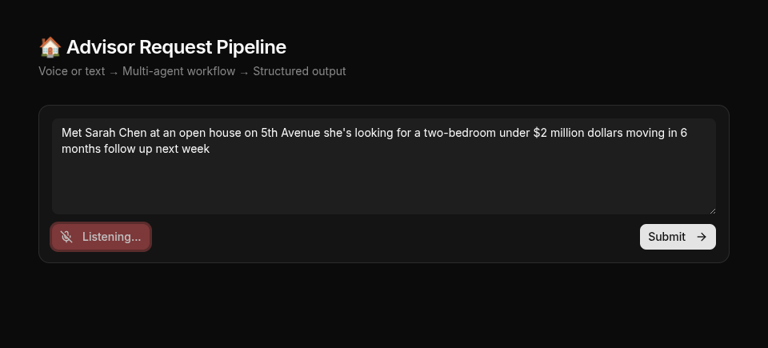
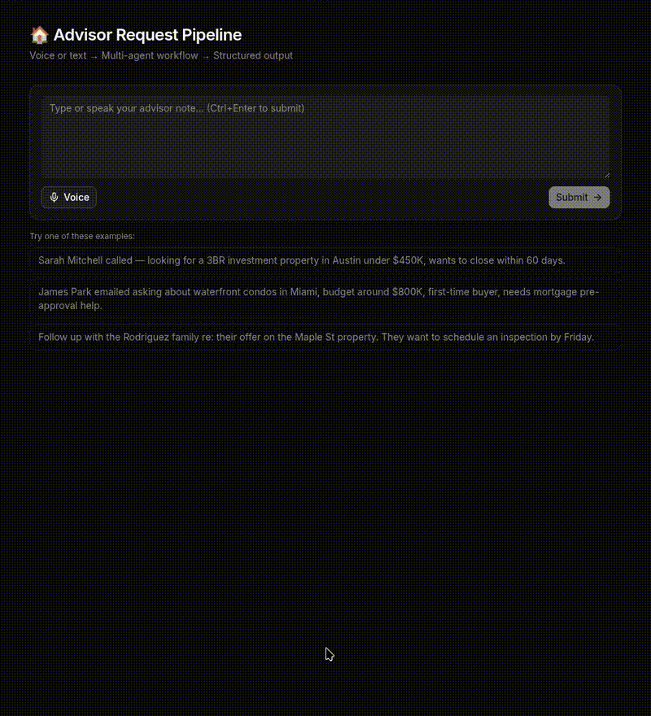
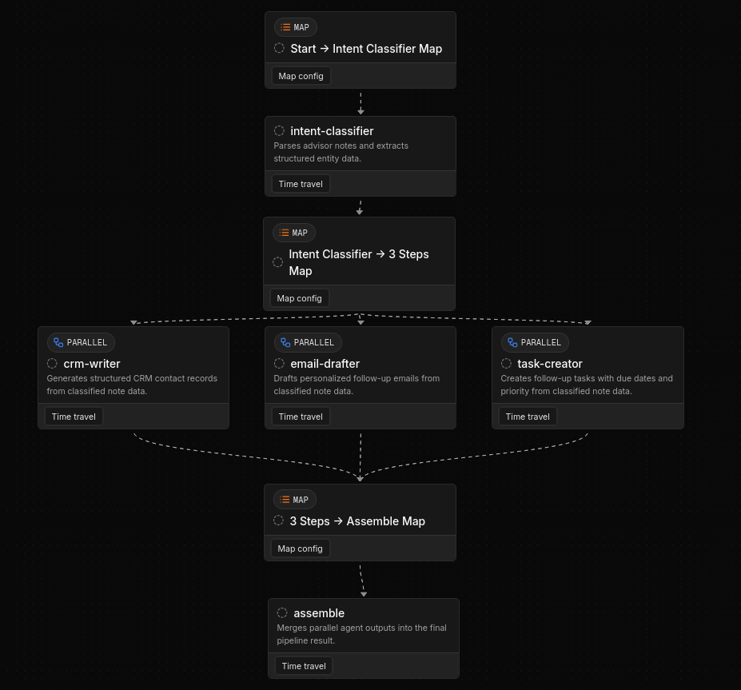

# Advisor Request Pipeline Demo





AI-powered pipeline that transforms real estate advisor notes into structured CRM records, follow-up emails, tasks, and property searches. Built with **Mastra** (AI orchestration), **Hono** (API), and **React + shadcn/ui** (frontend).

## Highlights

- 🎙️ **Voice or text input** — Web Speech API, zero external deps
- ⚡ **Real-time streaming** — SSE pipeline progress with per-step status
- 🔄 **Parallel agent execution** — 3 LLM calls run concurrently
- 🛡️ **End-to-end type safety** — shared Zod schemas validate server + client
- 🐳 **Easy deploy** — Docker multi-stage build, single binary deploy

## Additional Documentation

| Doc                         | Description                                                              |
| --------------------------- | ------------------------------------------------------------------------ |
| [API.md](docs/API.md)       | Hono HTTP server routes, request/response schemas, error handling        |
| [MASTRA.md](docs/MASTRA.md) | Agent definitions, workflow graph, structured output, Studio integration |
| [UI.md](docs/UI.md)         | Component tree, state management, interactivity, responsive layout       |

## Tech Stack

| Layer            | Tool           | Notes                                           |
| ---------------- | -------------- | ----------------------------------------------- |
| AI Orchestration | Mastra         | Agents, workflows, structured output, Studio    |
| Backend          | Hono 4         | Lightweight HTTP server, TypeScript-first       |
| Voice            | Web Speech API | Browser-native, no deps needed                  |
| Frontend         | React 19       | Functional components, hooks                    |
| Components       | shadcn/ui      | CLI-installed base copied into `components/ui/` |

## Workflow



## Model Configuration

All agents use the same model:

```ts
const MODEL = 'google/gemini-2.5-flash';
```

Mastra reads `GOOGLE_GENERATIVE_AI_API_KEY` from environment automatically when it encounters the `google/` prefix.

## Studio Integration

Mastra Studio (local dev UI) can visualize the workflow:

```bash
npx mastra dev
```

This opens Studio at `http://localhost:4111` showing:

- **Agents tab** — test each agent individually with custom prompts
- **Workflows tab** — visual graph of the workflow, run it with test input, see step-by-step results
- **Live execution** — watch each step complete in real-time

## Development Setup

```bash
# Terminal 1: Start Hono server
cd server
pnpm dev   # runs: tsx watch src/index.ts

# Terminal 2: Start Vite dev server
cd web
pnpm dev   # runs: vite (proxies /api/* to localhost:3000)
```

Or use a root-level script:

```json
{
  "scripts": {
    "dev": "concurrently \"pnpm --filter server dev\" \"pnpm --filter web dev\""
  }
}
```

## Responsive Behavior

| Breakpoint       | Layout                                                      |
| ---------------- | ----------------------------------------------------------- |
| Mobile (<768px)  | Single column. Cards stack vertically. Textarea full width. |
| Desktop (≥768px) | Two-column card grid. Max-width 5xl (1024px) centered.      |

No tablet-specific layout needed. The `md:grid-cols-2` handles the breakpoint.
